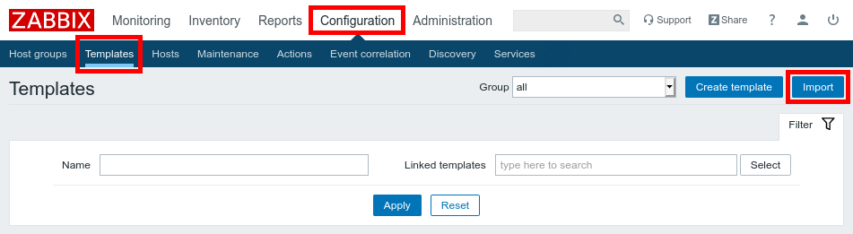
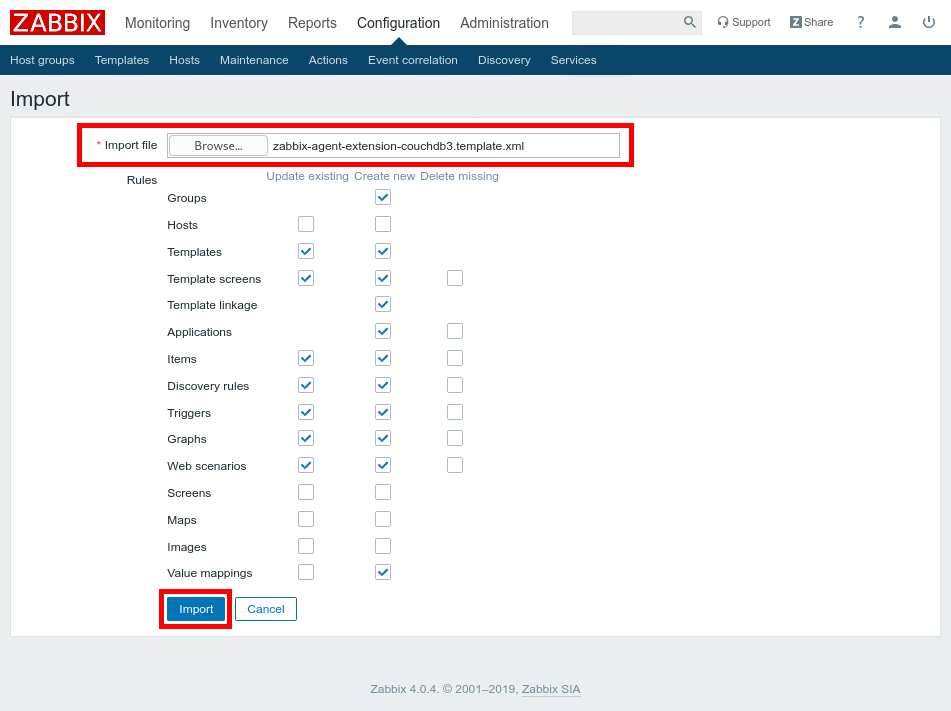
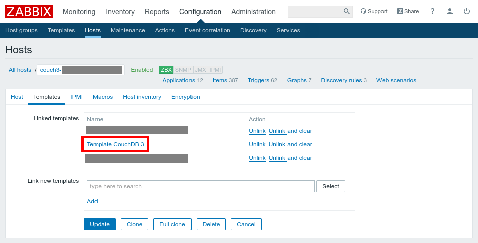
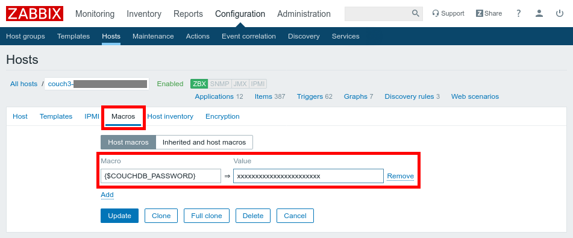

Zabbix Agent extension to monitor CouchDB 3
===========================================

This is an extension for the Zabbix 4.x Agent to enable it to monitor CouchDB
3 servers.

Requirements
------------

* Zabbix 4.0+
* Python 3.5+
* `py-zabbix <https://github.com/adubkov/py-zabbix>`_

Installation (Agent side)
-------------------------

You first have to install the extension on the server that runs the Zabbix
Agent.

From PyPI
~~~~~~~~~

Run the following command (as root)::

    pip3 install zabbix-agent-extension-couchdb3

Then copy the ``zabbix-agent-extension-couchdb3.conf`` file from this
repository to the ``/etc/zabbix/zabbix_agentd.conf.d/`` folder on the server.

And finally, restart the Zabbix Agent (with systemd: ``systemctl restart
zabbix-agent``).

Installation (Zabbix side)
--------------------------

1. Import the template
~~~~~~~~~~~~~~~~~~~~~~

* Go to ``Configuration`` -> ``Templates``,
* and click on the ``Import`` button.

* Now select the template (``zabbix-agent-extension-couchdb3.template.xml``),
* and click on the ``Import`` button.

2. Add the template to a host
~~~~~~~~~~~~~~~~~~~~~~~~~~~~~

* Go to the host configuration,
* and link the ``Template CouchDB 3`` tempate to it.

Doc: https://www.zabbix.com/documentation/4.0/manual/config/hosts/host

3. Configure connection information using macros
~~~~~~~~~~~~~~~~~~~~~~~~~~~~~~~~~~~~~~~~~~~~~~~~

* Go to the host configuration page,
* open the ``Macros`` tab,
* configure required parameters.

The following parameters are available:

* ``{$COUCHDB_HOST}``: the CouchDB host (optional, default: ``localhost``)
* ``{$COUCHDB_PASSWORD}``: the password to connect to CouchDB (required)
* ``{$COUCHDB_PORT}``: the CouchDB port (optional, default: ``5984``)
* ``{$COUCHDB_PROTO}``: the protocol to use to connect to CouchDB (``http`` or
  ``https``, optional, default: ``http``)
* ``{$COUCHDB_USER}``: the user to connect to CouchDB (optional, default:
  ``admin``)

**At least the** ``{$COUCHDB_PASSWORD}`` **macro must be defined!**

About polling interval
----------------------

The default polling interval of this probe in Zabbix is ``30s``. In order to
have accurate stats, you must configure the "stats interval" setting of your
CouchDB to twice this value (``60s``)::

    [stats]
    interval = 60

Read more `in the CouchDB documentation
<https://docs.couchdb.org/en/stable/api/server/common.html#node-node-name-stats>`_.

CLI Usage
---------

This extension also provides a CLI to simplify debugging.

::

    usage: zabbix-agent-extension-couchdb3
    [-h] [--host HOST] [--port PORT] [--user USER] --password PASSWORD
                       [--proto PROTO] [--show-json] [--show-stats] [--generate-template]

    optional arguments:
      -h, --help           show this help message and exit
      --host HOST          The CouchDB server host (default: localhost)
      --port PORT          The CouchDB server port (default: 5984)
      --user USER          The username to use for the connexion (default: admin)
      --password PASSWORD  The password to use for the connexion (mandatory)
      --proto PROTO        The protocol to use (default: http)
      --show-json          Display the raw JSON stats from CouchDB and exit (no stats will be
                           sent to Zabbix)
      --show-stats         Display the available stats with their values and description and exit
                           (no stats will be sent to Zabbix)
      --generate-template  Generates a Zabbix 4 template with all supported keys and exit (no
                       stats will be sent to Zabbix)

Example: dumping CouchDB stats as JSON::

    zabbix-agent-extension-couchdb3 --password=XXXXX --show-json

Example: displaying CouchDB stats in a more friendly format::

    zabbix-agent-extension-couchdb3 --password=XXXXX --show-stats

Example: generating the Zabbix template::

    zabbix-agent-extension-couchdb3 --password=XXXXX --generate-template > zabbix-agent-extension-couchdb3.template.xml

Changelog
---------

* **v1.0.1:** Send credential to CouchDB at first request instead of waiting
  for a 401 first
* **v1.0.0:**

  * Adds a command to generate the template from the available CouchDB stats
  * Adds a template for Zabbix 4.0
  * Adds documentation

* **v0.2.0:** Handles histogram-type values
* **v0.1.1:** Fixes an issue with the entry point
* **v0.1.0:** Initial release
